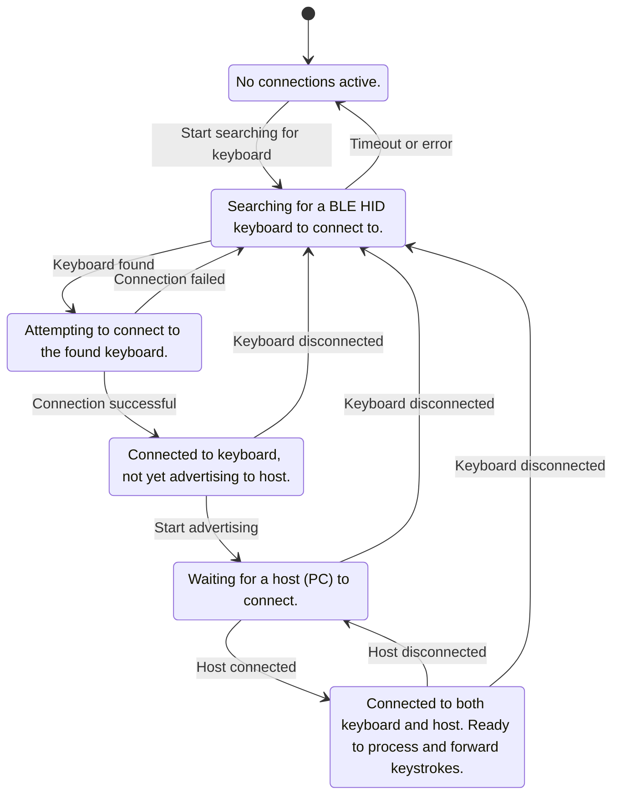

# What is this project?

This project allows you to apply macros to keyboards before they even reach your computer, with no noticeable delay. 

This is especially useful to address issues such as
- remapping any keys 
  - ANY key: windows, command, alt, etc
  - done before it reaches the computer, so you can rebind keys without original shortcuts triggering 
- avoid security concerns with programs downloaded on the internet
  - this code is all hacked together from the btstack repo examples, and doesn't contain any capability to connect to the internet. All the code is in one file and (relatively) easy to follow.

future additions
- activity tracking
- mouse rebindings
- improved security in pairing (code request)
- support for mimicing the captured keyboard's BT advertisements

## Architecture

Here is a state diagram outlining the desired robust architecture for handling connections and disconnections:

